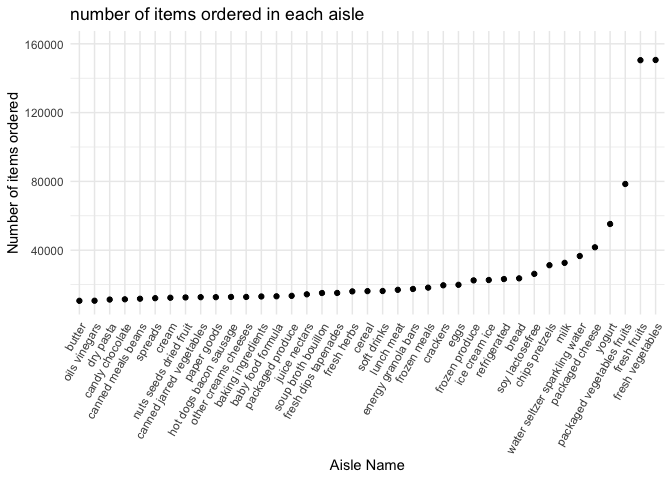
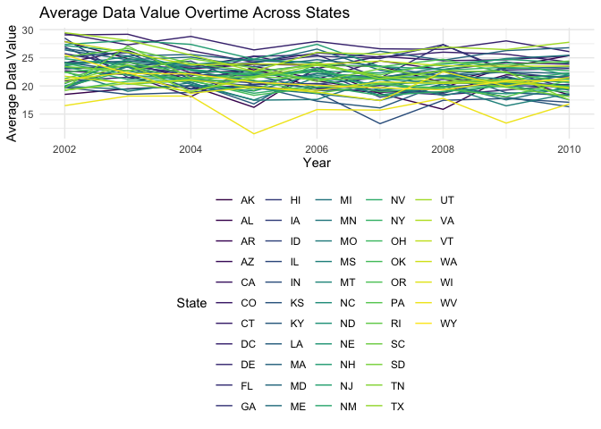
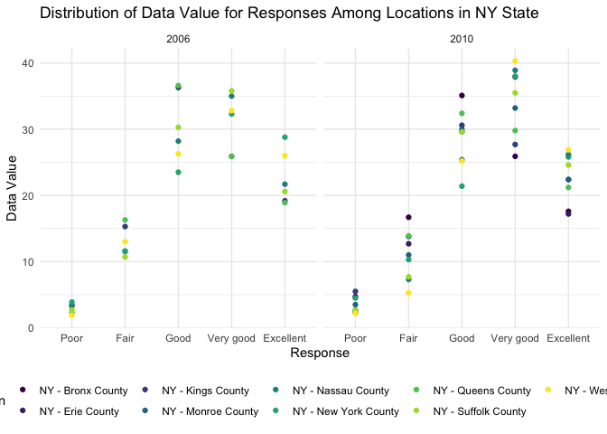

p8105_hw3_tw2918
================
2023-10-07

# Problem 1

## 1. Load Data

``` r
library(p8105.datasets)
data("instacart")
```

## 2. write a short description of the dataset, noting the size and structure of the data, describing some key variables, and giving illustrative examples of observations.

- The dataset contains cleaned and limited data of the “The Instacart
  Online Grocery Shopping Dataset 2017”, which records theover 3 million
  online grocery orders from more than 200,000 Instacart users. \*The
  dataset contains 1384617 observations and 15 variables. Each
  `row`/observation in the dataset is a product from an order.
- Some variables reflect key identifications of the orders and customers
  including `order_id` and `order_id`. There is a single order per
  consumers in this dataset.
- `eval_set`reflects evaluation set this order belongs in, which is
  exclusively “`train`” in this dataset.
- `order_number` reflects the order sequence number for this user. Its
  value ranges from 4 to100. The average order_number is 17.0914101.
- Some variables reflect key information of the products, including
  `product_id` and `product_name`, which aisle and department the
  prodcuts are purchased from, including `aisle_id`, `aisle`,
  `department_id` and `department`, and the order in which each product
  was added to cart `add_to_cart_order` , from 1 to 80.
- `reordered` variable is a binary indicator off this prodcut has been
  ordered by this user in the past, 0 otherwise.
- The rest of the varialbes reflect date and time of the order,
  including the day of the week on which the order was placed
  `order_dow` , the hour of the day on which the order was placed,
  `order_hour_of_day`, and days since the last order, capped at `30`,
  `NA` if `order_number=1`. The average days since the last order is
  13.5775922.

## 3. Answer questions and comments on result

### Calculate number of aisle in dataset and which aisles is the most items ordered from

``` r
mode = function(x, na.rm = FALSE) {
  if(na.rm){ #if na.rm is TRUE, remove NA values from input x
    x = x[!is.na(x)]
  }
  val <- unique(x)
  return(val[which.max(tabulate(match(x, val)))])
}

mode(instacart$aisle_id)
```

    ## [1] 83

``` r
mode(instacart$aisle)
```

    ## [1] "fresh vegetables"

- There are 134 aisles in the dataset, and aisle 83, fresh vegetables
  aisles is the most items ordered from.

### Make a plot that shows the number of items ordered in each aisle, limiting this to aisles with more than 10000 items ordered. Arrange aisles sensibly, and organize your plot so others can read it.

``` r
instacart |>
  count(aisle)|>
  filter(n > 10000) |>
  mutate(aisle = fct_reorder(aisle, n)) |> 
  ggplot(aes(x = aisle, y = n )) +
  geom_point() +
  labs(
    title = "number of items ordered in each aisle",
    x = "Aisle Name",
    y = "Number of items ordered",
  ) +
  scale_y_continuous(
    limits = c(10000, 160000)
  )+
  theme(axis.text.x =element_text(angle = 60, hjust = 1))
```

<!-- -->

### Make a table showing the three most popular items in each of the aisles “baking ingredients”, “dog food care”, and “packaged vegetables fruits”. Include the number of times each item is ordered in your table.

``` r
instacart |>
  select(aisle, product_name, everything()) |>
  filter(aisle == c("baking ingredients", "dog food care", "packaged vegetables fruits")) |>
  group_by(aisle) |>
  count(product_name)|>
  mutate(rank = min_rank(desc(n)))|>
  filter(rank< 4)|>
  arrange(desc(n))|>
  knitr::kable()
```

| aisle                      | product_name                                    |    n | rank |
|:---------------------------|:------------------------------------------------|-----:|-----:|
| packaged vegetables fruits | Organic Baby Spinach                            | 3324 |    1 |
| packaged vegetables fruits | Organic Raspberries                             | 1920 |    2 |
| packaged vegetables fruits | Organic Blueberries                             | 1692 |    3 |
| baking ingredients         | Light Brown Sugar                               |  157 |    1 |
| baking ingredients         | Pure Baking Soda                                |  140 |    2 |
| baking ingredients         | Organic Vanilla Extract                         |  122 |    3 |
| dog food care              | Organix Grain Free Chicken & Vegetable Dog Food |   14 |    1 |
| dog food care              | Organix Chicken & Brown Rice Recipe             |   13 |    2 |
| dog food care              | Original Dry Dog                                |    9 |    3 |

### Make a table showing the mean hour of the day at which Pink Lady Apples and Coffee Ice Cream are ordered on each day of the week; format this table for human readers (i.e. produce a 2 x 7 table).

``` r
instacart |>
  select (product_name, order_hour_of_day, order_dow)|>
  filter(product_name == c("Pink Lady Apples", "Coffee Ice Cream")) |>
  mutate(
    dow = recode(order_dow, "0" = "day_0", "1" = "day_1", "2" = "day_2", "3" = "day_3", "4" = "day_4", "5" = "day_5", "6" = "day_6"))|>
  group_by(product_name, dow)|>
  summarize(mean_hour = mean(order_hour_of_day))|>
  pivot_wider(
    names_from = dow,
    values_from = mean_hour
  ) |>
  knitr::kable(digits = 2)
```

    ## Warning: There was 1 warning in `filter()`.
    ## ℹ In argument: `product_name == c("Pink Lady Apples", "Coffee Ice Cream")`.
    ## Caused by warning in `product_name == c("Pink Lady Apples", "Coffee Ice Cream")`:
    ## ! longer object length is not a multiple of shorter object length

    ## `summarise()` has grouped output by 'product_name'. You can override using the
    ## `.groups` argument.

| product_name     | day_0 | day_1 | day_2 | day_3 | day_4 | day_5 | day_6 |
|:-----------------|------:|------:|------:|------:|------:|------:|------:|
| Coffee Ice Cream | 13.22 | 15.00 | 15.33 | 15.40 | 15.17 | 10.33 | 12.35 |
| Pink Lady Apples | 12.25 | 11.68 | 12.00 | 13.94 | 11.91 | 13.87 | 11.56 |

# Problem 2

## 1. Load Data

``` r
library(p8105.datasets)
data("brfss_smart2010")
```

## 2. Data Cleaning

``` r
brfss_df = brfss_smart2010 |>
  janitor::clean_names()|>
  rename(state = locationabbr, state_county = locationdesc) |>
  filter(topic == "Overall Health") |>
  mutate(response = factor(response, levels = c("Poor", "Fair", "Good", "Very good", "Excellent"))) |>
  arrange(response)
```

## 3. Answer Questions

In 2002, which states were observed at 7 or more locations? What about
in 2010?

``` r
brfss_df |>
  filter(year == 2002 | year == 2010) |>
  group_by(year, state)|>
  summarize(location = n_distinct(state_county)) |>
  filter(location>=7) |>
  arrange(year, location) |>
  knitr::kable()
```

    ## `summarise()` has grouped output by 'year'. You can override using the
    ## `.groups` argument.

| year | state | location |
|-----:|:------|---------:|
| 2002 | CT    |        7 |
| 2002 | FL    |        7 |
| 2002 | NC    |        7 |
| 2002 | MA    |        8 |
| 2002 | NJ    |        8 |
| 2002 | PA    |       10 |
| 2010 | CO    |        7 |
| 2010 | PA    |        7 |
| 2010 | SC    |        7 |
| 2010 | OH    |        8 |
| 2010 | MA    |        9 |
| 2010 | NY    |        9 |
| 2010 | NE    |       10 |
| 2010 | WA    |       10 |
| 2010 | CA    |       12 |
| 2010 | MD    |       12 |
| 2010 | NC    |       12 |
| 2010 | TX    |       16 |
| 2010 | NJ    |       19 |
| 2010 | FL    |       41 |

- The table shows the states that were observed at 7 or more locations
  in 2002 and 2010. In 2002,CT,FL,NC,MA NJ, and PA were observed at 7 or
  more location. In 2010, CO, PA, SC, OH, MA, NY, NE, WA, CA, MD, NC,
  TX, NJ and FL were observed at 7 or more location.

Construct a dataset that is limited to Excellent responses, and
contains, year, state, and a variable that averages the data_value
across locations within a state. Make a “spaghetti” plot of this average
value over time within a state (that is, make a plot showing a line for
each state across years – the geom_line geometry and group aesthetic
will help).

``` r
brfss_df |>
  filter(response == "Excellent") |>
  group_by(year, state) |>
  summarize(mean_data_value = mean(data_value, na.rm = TRUE)) |>
  ggplot(aes(x = year, y = mean_data_value, color = state )) +
  geom_line() +
   labs(
    title = "Average Data Value Overtime Across States",
    x = "Year",
    y = "Average Data Value",
    color = "State"
    ) 
```

    ## `summarise()` has grouped output by 'year'. You can override using the
    ## `.groups` argument.

<!-- -->

Make a two-panel plot showing, for the years 2006, and 2010,
distribution of data_value for responses (“Poor” to “Excellent”) among
locations in NY State.

``` r
brfss_df |>
  filter(year == 2006 | year == 2010, state == "NY") |>
  ggplot(aes(x = response, y = data_value, color = state_county)) +
  geom_point()+
  facet_grid(. ~ year)+
  labs(
    title = "Distribution of Data Value for Responses Among Locations in NY State",
    x = "Response",
    y = "Data Value",
    color = "Location"
    ) 
```

<!-- -->

# Problem 3

## 1. Load, tidy, merge, and otherwise organize the data sets.

Include all originally observed variables Exclude participants less than
21 years of age, and those with missing demographic data; And encode
data with reasonable variable classes (i.e. not numeric, and using
factors with the ordering of tables and plots in mind).

``` r
nhanes_demo_df = read_csv("./data/nhanes_covar.csv", skip = 4) |>
  janitor::clean_names()|>
  mutate(
    sex = ifelse(sex == 1, "male", "female"),
    education = recode(education,
         "1" = "Less than high school", 
         "2" = "High school equivalent", 
         "3" = "More than high school"
         )
    )|>
  mutate(education = factor(education, levels = c("Less than high school", "High school equivalent", "More than high school")))
```

    ## Rows: 250 Columns: 5
    ## ── Column specification ────────────────────────────────────────────────────────
    ## Delimiter: ","
    ## dbl (5): SEQN, sex, age, BMI, education
    ## 
    ## ℹ Use `spec()` to retrieve the full column specification for this data.
    ## ℹ Specify the column types or set `show_col_types = FALSE` to quiet this message.

``` r
nhanes_accel_df = read.csv("./data/nhanes_accel.csv")|>
  janitor::clean_names()

nhanes_df = 
  full_join(nhanes_demo_df, nhanes_accel_df) |>
  drop_na(sex | age | bmi | education)|>
  filter(age >= 21)
```

    ## Joining with `by = join_by(seqn)`

## 2. Produce a reader-friendly table for the number of men and women in each education category, and create a visualization of the age distributions for men and women in each education category. Comment on these items.

``` r
nhanes_df |>
  group_by(education)|>
  count()
```

    ## # A tibble: 3 × 2
    ## # Groups:   education [3]
    ##   education                  n
    ##   <fct>                  <int>
    ## 1 Less than high school     55
    ## 2 High school equivalent    58
    ## 3 More than high school    115
